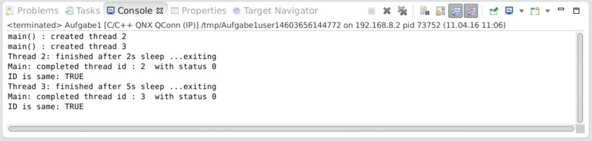

# Praktikum 1

Team: René Zarwel & Fabian Holtkötter

## 1. Create
### 1.1 Joinable

Wenn ein Thread mit PTHREAD_CREATE_JOINABLE aufgerufen wird, dann kann sich ein anderer Thread mit diesem verbinden.
Für weitere Infos zu den Möglichkeiten von verbunden Threads siehe: 2. Join
Neu erstelle Threads sind standardmäßig joinable.

### 1.2 Detachable

Wenn ein Thread mit PTHREAD_CREATE_DETACHED aufgerufen wird, dann werden nach der Terminierung sämtliche
Resourcen freigegeben. Ein joinable Thread kann später über die Methode pThread_detach() detached werden.

## 2. Join

Blockt den aufrufenden Thread, bis der angegebene Thread terminiert. Z.B. ruft Thread 1 auf Thread 2
pthread_join() auf, blockiert Thread 1 so lange bis Thread 2 terminiert.
Beim Verbinden von 2 Threads kann ein void Pointer übergeben werden, damit der terminierende Thread dem verbunden
Thread beim Exit einen Wert übergeben kann.

## 3. Exit
Der aufrufende Thread wird terminiert und alle über join verbundene Threads lösen sich aus der Blockierung.
Über das Exit kann den verbundenen Threads ein Übergabewert übertragen werden.

## 4. Aufgabe 1.3

-> Siehe Aufgabe1.c

Das Programm erstellt n Threads, welches über NUM_THREADS eingestellt werden kann, und startet diese. Zur Ausführung
wird ein Pointer auf die threadPrint Methode übergeben. Diese Methode wartet eine zufällige Zeispanne zwischen 1 und 5s
und beendet sich dann mit dem Rückgabewert der eigenen Thread ID.
Derweil verbindet sich der Main-Thread mit den erstellten Threads und wartet auf deren Abschluss. Wenn ein Thread
fertig ist, dann vergleicht der Main-Thread die zurückgegebene ID mit der gespeicherten und gibt das Ergebnis aus.
Einen Beispiel Ablauf haben wir hier in einem Screenshot dargestellt:

