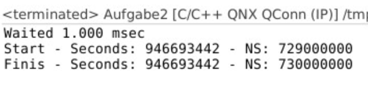
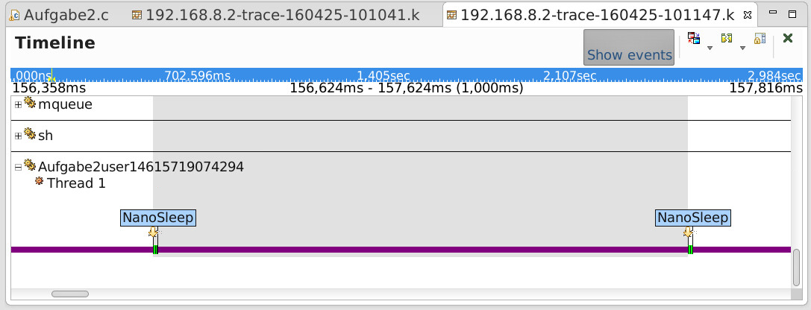
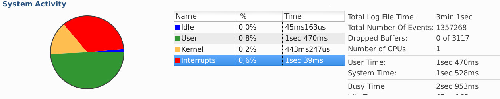
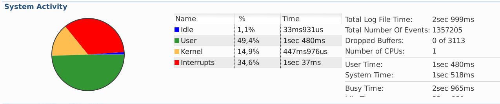
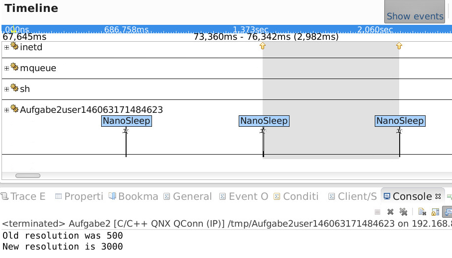

# Praktikum 2

Team: René Zarwel & Fabian Holtkötter

## 2.1

Zum warten von genau einer Millisekunde wird die Möglichkeit herangezogen, der Methode `clock_nanosleep` einen absoluten Zeitpunkt zu übergeben
an dem das Programm weiterlaufen soll.

Im Gegensatz zur Variante eine relative Wartezeit anzugeben, hat dies den Vorteil, dass etwaige debug-ouputs o.ä. die Wartezeit nicht verfälschen.

Zunächst wird mithilfe von `clock_gettime` die aktuelle Systemzeit gespeichert,
anschließend wird zu diesem `time_struct` eine Millisekunde (1.000.000 Nanosekunden) addiert und das Ergebnis als Parameter an `clock_nanosleep` übergeben.

Zum testen der tatsächlich gewarteten Zeit wurde einerseits eine Konsolenausgabe implementiert,
die sowohl vor, als auch nach dem warten die Systemzeit ausgibt, und außerdem ein System-Log erstellt,
in dem anhand der Interrupts des Programms die gewartete Zeit nach der Ausführung gemessen werden kann.

## 2.2

Die Implementierung der Funktion `changeSystemTick` war relativ trivial. Zum ändern des Systemtakts musste ein struct vom typ `_clockperiod` erstellt werden,
dieses mit dem übergebenen Wert (umgerechnet in Nanosekunden) initalisiert und anschließend an die Methode `ClockPeriod` übergeben werden.
Um die vorherige Konfiguration auszugeben, wird der alte Takt in einem weiteren `_clockperiod`-struct gespeichert.

Der minimal, gerade noch sinnvolle Wert für den Systemtakt lässt sich über das System-Logfile ermitteln.
Wenn der Wert besonders niedrig ist, kommt der Prozessor aufgrund der durchgehenden abhandlung von vielen Interrupts nicht mehr zum ausführen von anderen Tasks,
während ein zu hoher Systemtakt (bspw. über 1000 Millisekunden) dazu führen kann, dass Wartezeiten im Programm unter 1000ms nicht mehr korrekt funktionieren.

### Konfiguration 9µs

### Konfiguration 10µs

Bei der Konfiguration mit 9ms fällt auf, dass sämtliche Statistiken des Systemlogs keinen Sinn mehr ergeben.
Auch schafft es das Programm nicht mehr eine Ausgabe auf der Konsole auszuführen. Mit der Konfiguration von 10ms läuft das System stabil, ebenso wie das Programm.
Somit ist dies die minimal mögliche und noch sinnvolle Konfiguration.

## 2.3

Eine zu hohe Konfiguration des Systemtakts (Takt > Wartezeit) führt dazu,
dass nicht mehr zuverlässig gewartet wird. Dies geschieht, da die Systemzeit seltener aktualisiert wird, 
und das Programm erst zur nächsten Änderung geweckt wird. Wenn die eingestellte Frequenz höher ist als die Wartezeit, ist die Wartezeit abgelaufen bevor der nächste Takt kommt. Somit funktioniert der Timer nicht mehr korrekt.
Siehe dazu den folgenden Screenshot.

### Konfiguration 3000µs
