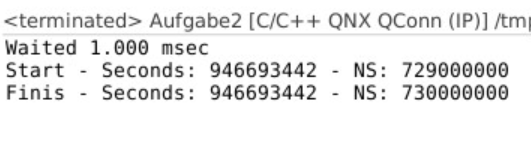
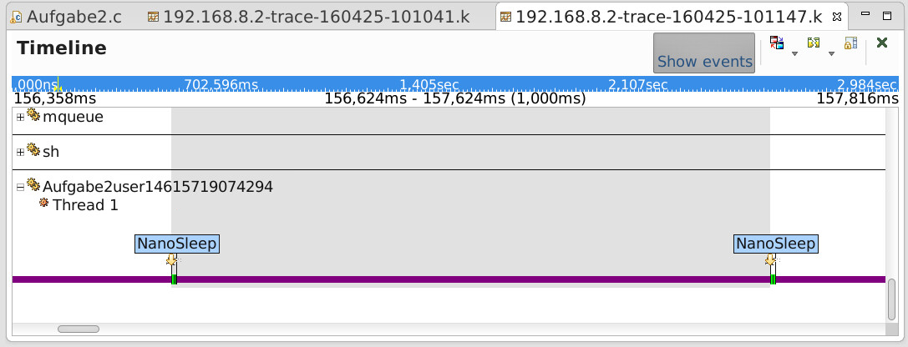

# Praktikum 2

Team: René Zarwel & Fabian Holtkötter

## 2.1

Zum warten von genau einer Millisekunde wird diemöglichkeit herangezogen der Methode `clock_nanosleep` einen absoluten Zeitpunkt zu übergeben
an dem das Programm weiterlaufen soll.

Im gegensatz zur Möglichkeit eine zu wartende Zeit anzugeben, hat dies den vorteil, dass etwaige debug-ouputs o.ä. die Wartezeit nicht verfälschen.

Zunächst wird mithilfe von `clock_gettime` die aktuelle Systemzeit gespeichert,
anschließend wird zu diesem `time_struct` eine Millisekunde (1000000 Nansosekunden) addiert und das Ergebnis als Parameter an clock_nanosleep übergeben.

Zum testen der tatsächlich gewarteten Zeit wurde einerseits eine Konsolenausgabe implementiert,
die sowohl vor als auch nach dem warten die Systemzeit ausgibt, und außerdem ein System-Log erstellt,
in dem anhand der Interrupts des Programms die gewartete Zeit nach der Ausführung gemessen werden kann.

## 2.2

Die Implementierung dieser Methode war relativ simpel. Zum ändern des Systemtakts musste ein struct vom typ `_clockperiod` erstellt werden,
dieses mit dem übergebenen Wert (umgerechnet in nanosekunden) initalisiert und anschließend an die Methode `ClockPeriod` übergeben werden.
Um die vorherige Konfiguration auszugeben wird der alte Takt in einem weiteren `_clockperiod`-struct gespeichert.

Der minimal gerade sinnvolle Wert für den Systemtakt lässt sich über das System-Logfile ermitteln.
Wenn der Wert besonders niedrig ist, kommt der Prozessor vor lauter interrupts nicht mehr zum abarbeiten von anderen Tasks,
während ein zu hoher Systemtak (bspw. über 1000 millisekunden) dazu führen kann, dass Wartezeiten unter 1000ms nicht mehr korrekt funktionieren.

## 2.3