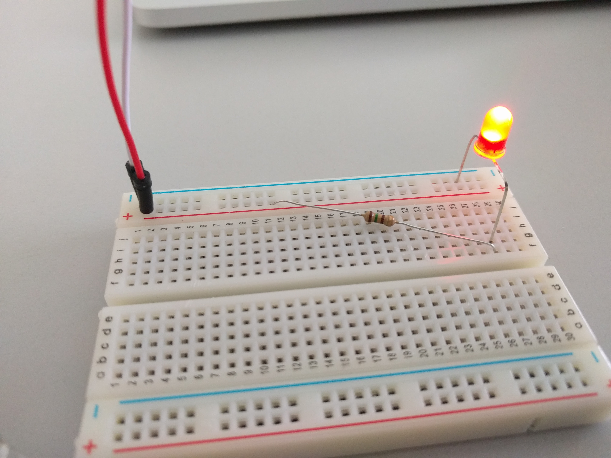

# Praktikum 3
Fabian Holtkötter & René Zarwel

# Aufgabe 3A

## Wie wird auf die LEDs zugegriffen?

Über die system-files unter dem Pfad `/sys/class/leds`. In diesem Ordner finden sich
für jede LED aufdem Board einen weiteren Unterordner `beaglebone:green:usr*`,
wobei `*` die Nummer der LED darstellt.
In jedem dieser Ordner finden sich die folgenden Dateien:
```
brightness (ermöglicht die Steuerung der Helligkeit. Gültig sind Werte zw. 0 und 255)
device (Link auf GPIO-Pin)
max_brightness (maximale einstellbare Helligkeit)
power
subsystem
trigger (s.u.)
uevent
```

Der einfachste Weg eine Led zum leuchten zu bringen ist, in das brightness-File den Wert 255 zu schreiben.

## Was bedeutet der `trigger mode`?

Der Trigger-Mode ermöglicht das steuern der LEDs anhand von kernel-events.
So ist es beispielsweise einfach möglich eine LED anhand von HDD-Zugriffen oder mithilfe eines
Timers zu steuern.

## Bash-Script zum blinken lassen der LEDs
```bash
echo timer > /sys/class/leds/beaglebone\:green\:usr1/trigger;
echo 500 > /sys/class/leds/beaglebone\:green\:usr1/delay_off;
echo 1000 > /sys/class/leds/beaglebone\:green\:usr1/delay_on;

echo timer > /sys/class/leds/beaglebone\:green\:usr3/trigger;
echo 1000 > /sys/class/leds/beaglebone\:green\:usr3/delay_off;
echo 500 > /sys/class/leds/beaglebone\:green\:usr3/delay_on;
```

# Aufgabe 3B

Zunächst musste die Anzahl an übergebenen Parametern geprüft werden. Dabei war zu beachten,
dass der erste Parameter bei Programmaufruf ein Systemparameter ist, und somit
erst die Parameter mit Index 1 und 2 relevant waren.

Danach wird das device-file (`/dev/leds`) geöffnet und die File-Destination gespeichert.

Anschließend müssen diese mithilfe von `atoi` zu int gecastet werden. Dann werden
die einzelnen Stati der 4 LEDs berechnet und mit Shift- und Veroderungsoperationen zu einer
Bytemask verbunden die mithilfe von `write` an das Device übertragen wird.

Zum Abschluss darf nicht vergessen werden das Device-File wieder zu schließen.

# Aufgabe 3C

## Beschreibung

Da der GPIO 3.3V schaltet und die LED bei 2V 30mA benötigt, muss noch 1.3V auf einem Vorwiederstand abfallen.
Nach dem ohmschen Gesetzt (U = R * I) muss somit der Vorwiederstand 43.33 Ohm betragen. Wir haben eine 100 Ohm Wiederstand gewählt.
Unsere Schaltung ist unten dargestellt.

Um die LED einzuschalten, muss in den Systemdateien der LED die Richtung (Direction) auf "out" gesetzt werden und der Value auf 1.

## Schaltzeichnung

\ 

## Bilder der gesteckten Schaltung

\ 
\ 
\ 
