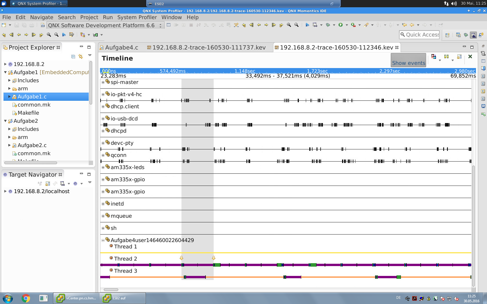

# Zyklisch kommunizierende Tasks

## Code

Wie in Aufgabe 1 haben wir mittels ```pthread_create``` 2 Tasks erzeugt. Der 1. Task ist für das Erhöhen des Semaphores zuständig, worauf der 2. Task wartet. Der Semaphor ist als globale Variable gespeichert und wird nach dem Programmstart in der Main initialisiert bevor die Tasks gestarted werden.

Für die Zyklus- und Verarbeitungszeit von Task 1 sowie Task2 haben wir uns für ```clock_nanosleep()``` mit ```CLOCK_REALTIME``` entschieden, damit die Zykluszeit nicht von der Verarbeitungszeit beeinflusst wird.

Für die Erweiterung um einen zyklischen Timer haben wir einen kommunikations Kanal erzeugt, über den der Timer in einem 4ms Interval ein Event erzeugt. Dieses wird vom Task1Cyclic über ```MsgReceive()``` abgefangen und somit die Verarbeitung gestarted. Der Rest verhält sich analog zu der vorherigen Lösung.

## Trace

Im markierten Bereich sieht man eine Zyklus-Periode von dem Task 1. Zu dieser Zeit war der Verarbeitungszähler auf 3 gesetzt, weshalb der 2. Task auch "aktiv" ist (lila). Anschließend wartet der Task 2 auf den Semaphor (orange), welchen der 1. Task nach 3 Zyklen erhöht.

\ 
